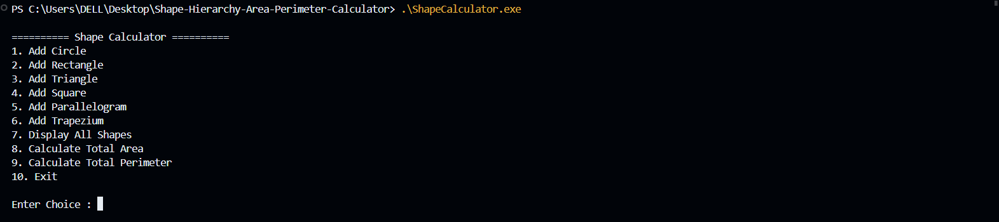
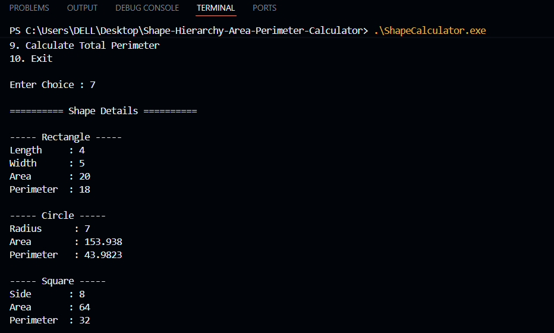
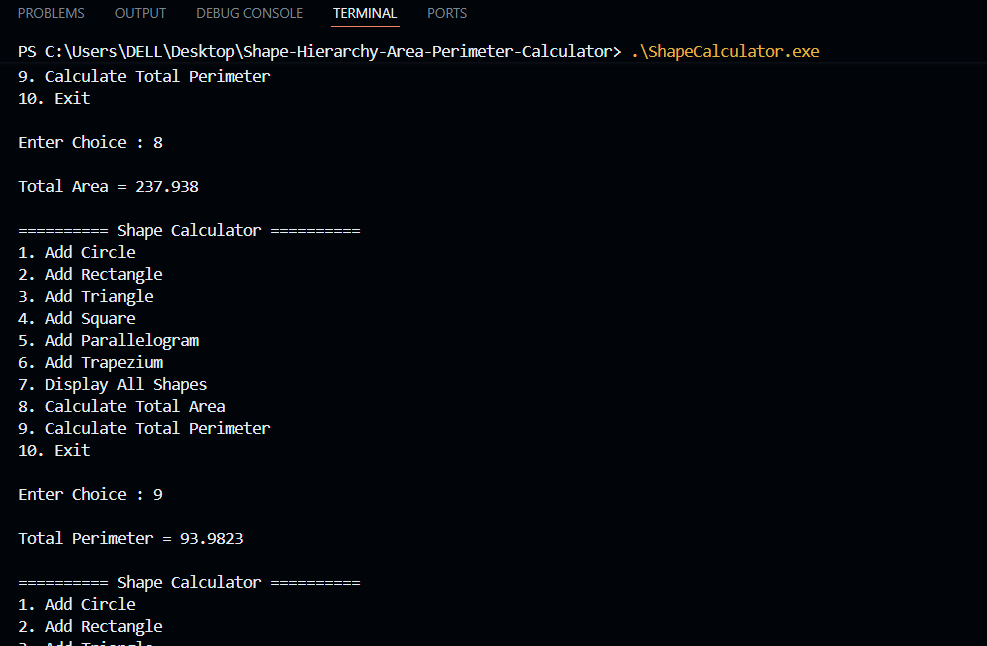

<div align="center">

# 📐 Shape Hierarchy Area & Perimeter Calculator

### 🚀 Modern C++ Object-Oriented Programming Project

A menu-driven C++ application showcasing **Abstraction**, **Inheritance**, **Runtime Polymorphism**, **Function Overriding**, and **Dynamic Memory Allocation** through geometric shape calculations.

<br>


<br>

⭐ **If you like this project, don't forget to Star the Repository!**

</div>

---

# 📖 Project Overview

The **Shape Hierarchy Area & Perimeter Calculator** is a C++ console application developed using Object-Oriented Programming principles.

The project demonstrates how multiple geometric shapes can inherit from a common **Abstract Shape Class**, while using **Runtime Polymorphism** to calculate the **Area** and **Perimeter** of different shapes dynamically.

Unlike a basic calculator, this project focuses on writing **clean**, **modular**, and **maintainable** C++ code using multiple source files and proper OOP architecture.

---

# ✨ Key Features

- ✅ Menu Driven Console Application
- ✅ Abstract Base Class
- ✅ Pure Virtual Functions
- ✅ Runtime Polymorphism
- ✅ Function Overriding
- ✅ Dynamic Memory Allocation
- ✅ Multi File Project Structure
- ✅ Shape Validation
- ✅ Calculate Total Area
- ✅ Calculate Total Perimeter
- ✅ Clean & Readable Code

---

# 🎯 Supported Shapes

| Shape | Area | Perimeter |
|:------|:----:|:---------:|
| 🔵 Circle | ✅ | ✅ |
| ▭ Rectangle | ✅ | ✅ |
| 🔺 Triangle | ✅ | ✅ |
| ◼ Square | ✅ | ✅ |
| ▱ Parallelogram | ✅ | ✅ |
| ⏢ Trapezium | ✅ | ✅ |

---

# 🧠 OOP Concepts Demonstrated

| Concept | Used |
|---------|------|
| Abstract Class | ✅ |
| Pure Virtual Functions | ✅ |
| Inheritance | ✅ |
| Runtime Polymorphism | ✅ |
| Function Overriding | ✅ |
| Encapsulation | ✅ |
| Dynamic Memory Allocation | ✅ |
| STL Vector | ✅ |

---

# 🏗️ Class Design

```text
                 Shape (Abstract Class)
                       ▲
        ┌──────────────┼──────────────┐
        │              │              │
     Circle       Rectangle      Triangle
        │
      Square

        │
 Parallelogram

        │
   Trapezium
```

Every derived class overrides:

- area()
- perimeter()
- display()

using **Runtime Polymorphism**.

---

# 📂 Project Structure

```text
Shape-Hierarchy-Area-Perimeter-Calculator
│
├── Circle.cpp
├── Circle.h
│
├── Rectangle.cpp
├── Rectangle.h
│
├── Triangle.cpp
├── Triangle.h
│
├── Square.cpp
├── Square.h
│
├── Parallelogram.cpp
├── Parallelogram.h
│
├── Trapezium.cpp
├── Trapezium.h
│
├── Shape.h
├── main.cpp
│
├── screenshots
│   ├── menu.png
│   ├── display.png
│   └── total.png
│
├── .gitignore
└── README.md
```

---

# 🖥️ Console Menu

```text
1. Add Circle
2. Add Rectangle
3. Add Triangle
4. Add Square
5. Add Parallelogram
6. Add Trapezium
7. Display All Shapes
8. Calculate Total Area
9. Calculate Total Perimeter
10. Exit
```

---

# 📸 Project Preview

## 🏠 Main Menu

<p align="center">

</p>

---

## 📋 Display Shapes

<p align="center">

</p>

---

## 📊 Total Area & Perimeter

<p align="center">

</p>

---

# ⚙️ Build Instructions

## Clone Repository

```bash
git clone https://github.com/sushantranjan912/Shape-Hierarchy-Area-Perimeter-Calculator.git
```

---

## Compile

```bash
g++ *.cpp -o ShapeCalculator
```

---

## Run

Windows

```bash
.\ShapeCalculator.exe
```

Linux

```bash
./ShapeCalculator
```

---

# 💻 Tech Stack

| Technology | Purpose |
|------------|---------|
| C++ | Programming Language |
| OOP | Software Design |
| STL | Data Storage |
| VS Code | Development Environment |
| Git | Version Control |
| GitHub | Project Hosting |

---

# 📊 Project Highlights

- 📌 Fully Modular Codebase
- 📌 Separate Header & Source Files
- 📌 Runtime Polymorphism
- 📌 Input Validation
- 📌 Dynamic Object Creation
- 📌 Memory Management
- 📌 Professional Folder Structure

---

# 🎓 Learning Outcomes

This project helped in understanding:

- Designing Abstract Classes
- Writing Reusable Code
- Runtime Polymorphism
- Virtual Functions
- Dynamic Memory Allocation
- Multi-file Project Organization
- Git & GitHub Workflow

---

# 🚀 Future Enhancements

- File Handling
- Save & Load Shapes
- Delete Existing Shapes
- Shape Search
- Shape Sorting
- GUI using Qt
- OpenGL Visualization
- Unit Testing

---

# 👨‍💻 Developer

<div align="center">

## Sushant Ranjan

💻 Computer Science Student

🔗 GitHub

https://github.com/sushantranjan912

⭐ Thanks for visiting this repository!

</div>

---

<div align="center">

### Made with ❤️ using Modern C++ & Object-Oriented Programming

</div>
